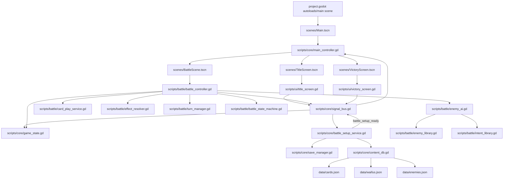

# Demon Lord Commander - System Map

This document is the project architecture map (runtime flow + file ownership).
Use this before editing systems to avoid tight coupling and duplicated logic.

## Correct Term

What you asked for is commonly called:
- architecture map
- system flow diagram
- dependency graph

## Runtime Flow (Current)

## System Ownership (Single Source of Truth)

- `SignalBus`: cross-system event contracts only (requests + broadcasts).
- `GameState`: authoritative runtime campaign/phase/player state.
- `SaveManager`: persistent player profile in `user://save_slot_1.json`.
- `ContentDB`: content ingestion + validation from `data/*.json`.
- `BattleSetupService`: composes normalized battle payload from save + content.
- `MainController`: scene flow orchestration only.
- `BattleController`: battle runtime logic only (uses setup payload, does not query raw content/save directly).

### Battle Sub-Services (used by BattleController, not direct entry points)

- `CardPlayService`: card play pipeline — mana cost, effect resolution, discard.
- `EffectResolver`: combat math (damage formulas, block, card attack bonuses).
- `TurnManager`: draw/discard pile utilities (shuffling, hand limits).
- `BattleStateMachine`: explicit battle phase enforcement (round_start → player_turn → enemy_turn → end_check).
- `EnemyAI`: intent selection + enemy turn resolution.
  - `EnemyLibrary`: enemy definitions and intent pattern resolution (class_name).
  - `IntentLibrary`: reusable intent type definitions and execution logic (class_name).

### UI Scripts (presentation layer, emit intent through SignalBus)

- `title_screen.gd`: title menu (new game, continue, options, quit, reset save).
- `victory_screen.gd`: post-battle victory screen (return to title).
- `main_waifu_sprites.gd`: sprite scaling/positioning within UI cards (enemy portrait helper).

## File Priority (Read This First)

### Core (read before any edit)

1. `demon-lords-commander/project.godot`
2. `demon-lords-commander/scripts/core/signal_bus.gd`
3. `demon-lords-commander/scripts/core/game_state.gd`
4. `demon-lords-commander/scripts/core/battle_setup_service.gd`
5. `demon-lords-commander/scripts/core/content_db.gd`
6. `demon-lords-commander/scripts/core/save_manager.gd`
7. `demon-lords-commander/scripts/core/main_controller.gd`

### Battle System

8. `demon-lords-commander/scripts/battle/battle_controller.gd`
9. `demon-lords-commander/scripts/battle/card_play_service.gd`
10. `demon-lords-commander/scripts/battle/effect_resolver.gd`
11. `demon-lords-commander/scripts/battle/turn_manager.gd`
12. `demon-lords-commander/scripts/battle/battle_state_machine.gd`
13. `demon-lords-commander/scripts/battle/enemy_ai.gd`
14. `demon-lords-commander/scripts/battle/enemy_library.gd`
15. `demon-lords-commander/scripts/battle/intent_library.gd`

### UI / Presentation

16. `demon-lords-commander/scripts/ui/title_screen.gd`
17. `demon-lords-commander/scripts/ui/victory_screen.gd`
18. `demon-lords-commander/scripts/battle/main_waifu_sprites.gd`

### Scenes

19. `demon-lords-commander/scenes/Main.tscn`
20. `demon-lords-commander/scenes/TitleScreen.tscn`
21. `demon-lords-commander/scenes/BattleScene.tscn`
22. `demon-lords-commander/scenes/VictoryScreen.tscn`

### Data / Content

23. `demon-lords-commander/data/cards.json`
24. `demon-lords-commander/data/waifus.json`
25. `demon-lords-commander/data/enemies.json`
26. `demon-lords-commander/data/save_template.json`
27. `demon-lords-commander/assets/art/ui/MainTheme.tres`

## Edit Rules (Modular Workflow)

- UI emits intent through `SignalBus`; UI does not mutate global state directly.
- Setup/data loading belongs in services (`SaveManager`, `ContentDB`, `BattleSetupService`), not battle UI/controller.
- Add new gameplay phase by:
  1) adding bus signal contract,
  2) adding service/state handling,
  3) wiring scene flow in `MainController`.
- Keep `GameState` synchronized at battle end and major transitions.

## Where To Add New Features

- New card/effect data: `demon-lords-commander/data/cards.json` + `ContentDB` validator.
- New waifu and bond templates: `demon-lords-commander/data/waifus.json`.
- New enemy/intents: `demon-lords-commander/data/enemies.json`.
- New save fields: `demon-lords-commander/scripts/core/save_manager.gd` + `data/save_template.json`.
- New battle rule execution: `demon-lords-commander/scripts/battle/battle_controller.gd`.
- New card play effects / targeting logic: `demon-lords-commander/scripts/battle/card_play_service.gd` + `effect_resolver.gd`.
- New turn mechanics (draw rules, hand limits): `demon-lords-commander/scripts/battle/turn_manager.gd`.
- New battle phases: `demon-lords-commander/scripts/battle/battle_state_machine.gd`.
- New enemy AI behaviors / intent patterns: `demon-lords-commander/scripts/battle/enemy_ai.gd` + `enemy_library.gd` + `intent_library.gd`.
- New cross-system communication: `demon-lords-commander/scripts/core/signal_bus.gd`.
- New UI screens: add `.tscn` in `demon-lords-commander/scenes/` + `.gd` in `demon-lords-commander/scripts/ui/`.
- New theme styles: `demon-lords-commander/assets/art/ui/MainTheme.tres`.

## Pre-Edit Checklist (Team + AI)

Before any substantive edit:
1. Read `Demon-Lords-Beloved-Commander-ProjectOverview.txt`.
2. Read `newcardrulesbeta.md`.
3. Confirm the feature owner system from this map.
4. Check the **File Priority** list above — all project `.gd`, `.tscn`, `.json`, and `.tres` files are documented there.
5. Add/adjust `SignalBus` contract before wiring downstream behavior.

## Session Continuity

- Use `DEVELOPMENT_CHANGELOG.md` to track what was completed, what is in progress, and what to do next.
- Add a new top entry after each coding session so long breaks do not lose context.

