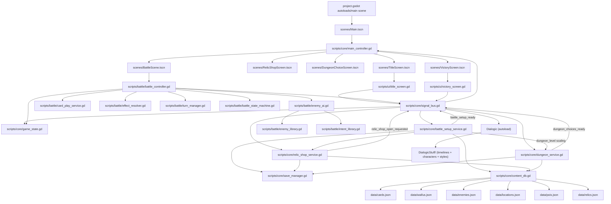

# Demon Lord Commander - System Map

This document is the project architecture map (runtime flow + file ownership).
Use this before editing systems to avoid tight coupling and duplicated logic.

## Correct Term

What you asked for is commonly called:
- architecture map
- system flow diagram
- dependency graph

## Runtime Flow (Current)

```mermaid
flowchart TD
    ProjectSettings["project.godot autoloads/main scene"] --> MainScene["scenes/Main.tscn"]
    MainScene --> MainController["scripts/core/main_controller.gd"]
    MainController --> TitleScene["scenes/TitleScreen.tscn"]
    TitleScene --> TitleScript["scripts/ui/title_screen.gd"]
    TitleScript --> SignalBus["scripts/core/signal_bus.gd"]

    SignalBus --> GameState["scripts/core/game_state.gd"]
    SignalBus --> BattleSetupService["scripts/core/battle_setup_service.gd"]
    BattleSetupService --> SaveManager["scripts/core/save_manager.gd"]
    BattleSetupService --> ContentDB["scripts/core/content_db.gd"]
    ContentDB --> CardsJson["data/cards.json"]
    ContentDB --> WaifusJson["data/waifus.json"]
    ContentDB --> EnemiesJson["data/enemies.json"]
    ContentDB --> LocationsJson["data/locations.json"]
    ContentDB --> PoisJson["data/pois.json"]
    ContentDB --> RelicsJson["data/relics.json"]

    SignalBus --> RelicShopService["scripts/core/relic_shop_service.gd"]
    RelicShopService --> SaveManager
    RelicShopService --> ContentDB
    RelicShopService -->|"relic_shop_open_requested"| SignalBus
    MainController --> RelicShopScreen["scenes/RelicShopScreen.tscn"]
    BattleSetupService --> RelicShopService

    SignalBus --> DungeonService["scripts/core/dungeon_service.gd"]
    DungeonService --> SaveManager
    DungeonService --> ContentDB
    DungeonService -->|"dungeon_choices_ready"| SignalBus
    MainController --> DungeonChoiceScreen["scenes/DungeonChoiceScreen.tscn"]
    BattleSetupService -->|"dungeon_level scaling"| DungeonService

    BattleSetupService -->|"battle_setup_ready"| SignalBus
    SignalBus --> MainController
    MainController --> BattleScene["scenes/BattleScene.tscn"]
    BattleScene --> BattleController["scripts/battle/battle_controller.gd"]
    BattleController --> GameState
    BattleController --> SignalBus

    BattleController --> CardPlayService["scripts/battle/card_play_service.gd"]
    BattleController --> EffectResolver["scripts/battle/effect_resolver.gd"]
    BattleController --> TurnManager["scripts/battle/turn_manager.gd"]
    BattleController --> BattleStateMachine["scripts/battle/battle_state_machine.gd"]
    BattleController --> EnemyAI["scripts/battle/enemy_ai.gd"]
    EnemyAI --> EnemyLibrary["scripts/battle/enemy_library.gd"]
    EnemyAI --> IntentLibrary["scripts/battle/intent_library.gd"]

    MainController --> VictoryScene["scenes/VictoryScreen.tscn"]
    VictoryScene --> VictoryScript["scripts/ui/victory_screen.gd"]
    VictoryScript --> SignalBus

    SignalBus --> DialogicAutoload["Dialogic (autoload)"]
    DialogicAutoload --> DialogicContent["DialogicStuff/ (timelines + characters + styles)"]
```

## System Ownership (Single Source of Truth)

- `SignalBus`: cross-system event contracts only (requests + broadcasts).
- `GameState`: authoritative runtime campaign/phase/player state.
- `SaveManager`: persistent player profile in `user://save_slot_1.json`.
- `ContentDB`: content ingestion + validation from `data/*.json`.
- `BattleSetupService`: composes normalized battle payload from save + content.
- `MainController`: scene flow orchestration only.
- `BattleController`: battle runtime logic only (uses setup payload, does not query raw content/save directly).
- `RelicShopService`: authoritative owner of relic inventory, gold deduction on purchase, relic duration tracking, and active buff resolution. No UI logic. Autoload.
- `DungeonService`: authoritative owner of dungeon run state (floor progress, pending node, run status, choice generation). No UI logic. Autoload. Never mutate `current_dungeon_run` from UI — always call `DungeonService.start_run()`, `complete_node()`, or `fail_run()`.

### Battle Sub-Services (used by BattleController, not direct entry points)

- `CardPlayService`: card play pipeline — mana cost, effect resolution, discard.
- `CardUI` (`card_ui.gd` + `Card.tscn`): reusable card scene — border, art, name, mana cost, effect text, scaling presets.
- `EffectResolver`: combat math (damage formulas, block, card attack bonuses).
- `TurnManager`: draw/discard pile utilities (shuffling, hand limits).
- `BattleStateMachine`: explicit battle phase enforcement (round_start → player_turn → enemy_turn → end_check).
- `EnemyAI`: intent selection + enemy turn resolution.
  - `EnemyLibrary`: enemy definitions and intent pattern resolution (class_name).
  - `IntentLibrary`: reusable intent type definitions and execution logic (class_name).
- **Summon System** (integrated across multiple files): summon placement, damage absorption (block → summons → player HP), taunt ordering, summon replacement mode, `SacrificeAllSummons`. Owned by `BattleController` state + `EffectResolver` damage routing + `CardPlayService` effect handling.
- `LocationService` (`location_service.gd`): resolves active events per location based on priority + story flag conditions; checks location/POI visibility (fog of war); handles runtime POI discovery via `discover_poi()`. `class_name` helper, no autoload.

### UI Scripts (presentation layer, emit intent through SignalBus)

- `title_screen.gd`: title menu (new game, continue, load game, options, quit, reset save). Opens slot picker for New Game/Continue/Load.
- `victory_screen.gd`: post-battle victory screen (return to title).
- `world_map_controller.gd`: location navigation UI — breadcrumb, positioned POI/location buttons (viewport-sized, map-bound), fog of war, pan/zoom with dynamic min-zoom, back navigation, action buttons from active events. Listens to `SignalBus.poi_discovered` for live refresh.
- `save_slot_overlay.gd`: save slot picker overlay — vertical scroll list of 10 slots with metadata, play/new/delete buttons.
- `main_waifu_sprites.gd`: sprite scaling/positioning within UI cards (enemy + summon portrait helper).
- `relic_shop_screen.gd`: relic shop overlay — displays 3 weighted-random relics, handles buy (delegates to `RelicShopService`) and reroll; never mutates save state directly.
- `dungeon_choice_screen.gd`: dungeon node choice overlay — shows 3 choice cards (1 on boss floor); emits `dungeon_node_selected` via SignalBus on player pick; never mutates run state directly.

## File Priority (Read This First)

### Session Start (read before anything else)

0. `running_plan.md` — AI-suggested next steps, ordered by impact. **These are recommendations only** — the dev is free to work on anything else. Read it for context on where the project stands, not as a mandatory work order.

### Core (read before any edit)

1. `demon-lords-commander/project.godot`
2. `demon-lords-commander/scripts/core/signal_bus.gd`
3. `demon-lords-commander/scripts/core/game_state.gd`
4. `demon-lords-commander/scripts/core/battle_setup_service.gd`
5. `demon-lords-commander/scripts/core/content_db.gd`
6. `demon-lords-commander/scripts/core/save_manager.gd`
7. `demon-lords-commander/scripts/core/main_controller.gd`

### Battle System

8. `demon-lords-commander/scripts/battle/battle_controller.gd`
9. `demon-lords-commander/scripts/battle/card_play_service.gd`
10. `demon-lords-commander/scripts/battle/card_ui.gd` + `scenes/Card.tscn`
11. `demon-lords-commander/scripts/battle/effect_resolver.gd`
12. `demon-lords-commander/scripts/battle/turn_manager.gd`
13. `demon-lords-commander/scripts/battle/battle_state_machine.gd`
14. `demon-lords-commander/scripts/battle/enemy_ai.gd`
15. `demon-lords-commander/scripts/battle/enemy_library.gd`
16. `demon-lords-commander/scripts/battle/intent_library.gd`

### UI / Presentation

17. `demon-lords-commander/scripts/ui/title_screen.gd`
18. `demon-lords-commander/scripts/ui/victory_screen.gd`
19. `demon-lords-commander/scripts/battle/main_waifu_sprites.gd`

### Scenes

20. `demon-lords-commander/scenes/Main.tscn`
21. `demon-lords-commander/scenes/TitleScreen.tscn`
22. `demon-lords-commander/scenes/WorldMap.tscn` — location navigation scene (background, positioned buttons, breadcrumbs, actions)
23. `demon-lords-commander/scenes/BattleScene.tscn`
24. `demon-lords-commander/scenes/VictoryScreen.tscn`
25. `demon-lords-commander/scenes/Card.tscn` — reusable card UI template (border, art, name, mana cost, effect text)
26. `demon-lords-commander/scenes/SaveSlotOverlay.tscn` — save slot picker overlay (panel, scroll list, 10 slot rows with metadata)
27. `demon-lords-commander/scenes/RelicShopScreen.tscn` — relic shop overlay (portrait panel + shop panel, z_index=10, full-rect overlay on world map)
28. `demon-lords-commander/scenes/DungeonChoiceScreen.tscn` — dungeon node choice screen (full-rect, z_index=10, 3-card layout built in script)

### Data / Content

28. `demon-lords-commander/data/cards.json`
29. `demon-lords-commander/data/waifus.json`
30. `demon-lords-commander/data/enemies.json`
31. `demon-lords-commander/data/locations.json` — location hierarchy, events, unlock conditions, fog regions, map_size
32. `demon-lords-commander/data/pois.json` — world map POI definitions (id, name, region, category, position, icon_path, target_location_id, unlock_condition)
33. `demon-lords-commander/data/relics.json` — relic definitions (id, name, description, rarity, cost, duration, art_path, effect{type, value, trigger})
36. `demon-lords-commander/data/dungeons.json` — dungeon templates (id, name, level, total_floors, boss_floor, normal/elite/boss pools, scripted_boss, floor_configs[])
34. `demon-lords-commander/data/save_template.json`
35. `demon-lords-commander/assets/art/ui/MainTheme.tres`

### Dialogic / VN Content

34. `demon-lords-commander/DialogicStuff/Chesy.dch` — Dialogic character definition (Chesy)
35. `demon-lords-commander/DialogicStuff/nyx.dch` — Dialogic character definition (nyx)
36. `demon-lords-commander/DialogicStuff/testtimeline.dtl` — sample Dialogic timeline
37. `demon-lords-commander/DialogicStuff/DialogicStyle.tres` — default Dialogic layout style
38. `demon-lords-commander/DialogicStuff/TextboxWithPortrait/speaker_portrait_textbox_layer.gd` — custom textbox portrait layer script
39. `demon-lords-commander/DialogicStuff/CustomChoices/custom_vn_choice_layer.tscn` — custom VN choice layer scene

## Edit Rules (Modular Workflow)

- UI emits intent through `SignalBus`; UI does not mutate global state directly.
- Setup/data loading belongs in services (`SaveManager`, `ContentDB`, `BattleSetupService`), not battle UI/controller.
- Add new gameplay phase by:
  1) adding bus signal contract,
  2) adding service/state handling,
  3) wiring scene flow in `MainController`.
- Keep `GameState` synchronized at battle end and major transitions.

## Where To Add New Features

- New card/effect data: `demon-lords-commander/data/cards.json` + `ContentDB` validator.
- New waifu and bond templates: `demon-lords-commander/data/waifus.json`.
- New enemy/intents: `demon-lords-commander/data/enemies.json`.
- New locations / world map nodes: `demon-lords-commander/data/locations.json` + `ContentDB` loader.
- New POIs: `demon-lords-commander/data/pois.json` + `ContentDB` loader + `LocationService.discover_poi()`.
- New location events / unlock conditions: `demon-lords-commander/data/locations.json` + `LocationService` condition checks.
- New relics: `demon-lords-commander/data/relics.json` + `ContentDB._ingest_relics()`. Add `id`, `name`, `description`, `rarity`, `cost`, `duration`, `art_path`, `effect{type,value,trigger}`. Rarity values: common/uncommon/rare/epic/legendary.
- New dungeons: `demon-lords-commander/data/dungeons.json` + `ContentDB._ingest_dungeons()`. Add `id`, `name`, `level` (1-10), `total_floors`, `boss_floor`, `normal_enemy_pool`, `elite_enemy_pool`, `boss_pool`, `scripted_boss`, `floor_configs[]`. Then add a POI in `pois.json` and wire via `SignalBus.request_dungeon_run(dungeon_id)` from a Dialogic signal or world map button.
- New dungeon node types: add type string to `DungeonService.NODE_LABELS` and `NODE_TYPE_ICONS`, add icon asset, add handler in `MainController._on_dungeon_node_selected()`.
- New relic effects at battle start: add handler in `BattleController._setup_battle()` / `_start_player_round()` for the new `type` string.
- New save fields: `demon-lords-commander/scripts/core/save_manager.gd` + `data/save_template.json`.
- New save slots: `demon-lords-commander/scripts/core/save_manager.gd` (dynamic paths) + `scripts/ui/save_slot_overlay.gd` (UI) + `scenes/SaveSlotOverlay.tscn`.
- New battle rule execution: `demon-lords-commander/scripts/battle/battle_controller.gd`.
- New card play effects / targeting logic: `demon-lords-commander/scripts/battle/card_play_service.gd` + `effect_resolver.gd`.
- New turn mechanics (draw rules, hand limits): `demon-lords-commander/scripts/battle/turn_manager.gd`.
- New battle phases: `demon-lords-commander/scripts/battle/battle_state_machine.gd`.
- New enemy AI behaviors / intent patterns: `demon-lords-commander/scripts/battle/enemy_ai.gd` + `enemy_library.gd` + `intent_library.gd`.
- New cross-system communication: `demon-lords-commander/scripts/core/signal_bus.gd`.
- New UI screens: add `.tscn` in `demon-lords-commander/scenes/` + `.gd` in `demon-lords-commander/scripts/ui/`.
- New world map navigation / POI placement: `demon-lords-commander/scenes/WorldMap.tscn` + `scripts/ui/world_map_controller.gd`. POI coordinates map 1:1 to `worldmap.png` pixels.
- New theme styles: `demon-lords-commander/assets/art/ui/MainTheme.tres`.
- New Dialogic characters: `demon-lords-commander/DialogicStuff/*.dch`.
- New Dialogic timelines: `demon-lords-commander/DialogicStuff/*.dtl`.
- New Dialogic styles/layouts: `demon-lords-commander/DialogicStuff/DialogicStyle.tres` + custom layer scenes in `DialogicStuff/`.

## Pre-Edit Checklist (Team + AI)

Before any substantive edit:
1. Read `Demon-Lords-Beloved-Commander-ProjectOverview.txt`.
2. Read `newcardrulesbeta.md`.
3. Confirm the feature owner system from this map.
4. Check the **File Priority** list above — all 40 project `.gd`, `.tscn`, `.json`, `.tres`, `.dch`, and `.dtl` files are documented there.
5. Add/adjust `SignalBus` contract before wiring downstream behavior.

## Session Continuity

- **Read `running_plan.md` at the start of each session** for context on where the project stands. It contains AI-suggested next steps ordered by impact — treat them as recommendations, not a required roadmap. The dev decides what to work on.
- Use `DEVELOPMENT_CHANGELOG.md` to track what was completed and when. Add a new top entry after each coding session.
- After completing a session, update `running_plan.md`: move finished items to the Done Log and revise the suggestions based on what changed.

